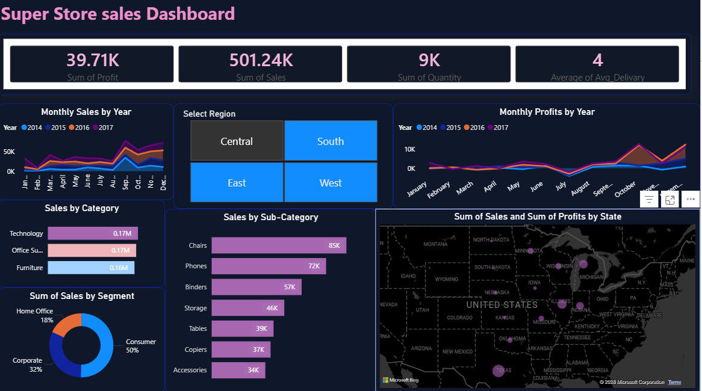

# 📊 Super Store Sales Dashboard

## 📌 Project Overview
The **Super Store Sales Dashboard** is an interactive Power BI project designed to analyze and visualize sales performance, profit trends, customer segments, and regional business insights from a super store dataset.

This dashboard helps businesses make data-driven decisions by providing a clear understanding of:
- Sales performance
- Profit analysis
- Regional trends
- Product category insights
- Customer segment distribution

---

# 🚀 Features

✅ Interactive KPI Cards  
✅ Monthly Sales Trend Analysis  
✅ Monthly Profit Trend Analysis  
✅ Region-wise Filtering  
✅ Category & Sub-Category Analysis  
✅ State-wise Sales Visualization  
✅ Customer Segment Analysis  
✅ Clean Dark-Themed Dashboard UI  

---

# 🛠️ Tools & Technologies Used

- **Power BI**
- **DAX (Data Analysis Expressions)**
- **Excel / CSV Dataset**
- **Data Visualization Techniques**
- **Business Intelligence Concepts**

---

# 📈 Dashboard Insights

## 1. KPI Metrics
The dashboard displays important business metrics such as:
- Total Sales
- Total Profit
- Average Delivery Time
- Total Quantity Sold

---

## 2. Monthly Sales Analysis
Tracks monthly sales trends across multiple years to identify:
- Growth patterns
- Seasonal demand
- Business performance trends

---

## 3. Profit Analysis
Visualizes monthly profits to help understand:
- Profit fluctuations
- High-performing periods
- Business profitability

---

## 4. Region-Wise Filtering
Interactive region slicer allows users to filter data based on:
- Central
- East
- South
- West

---

## 5. Category & Sub-Category Analysis
Provides insights into:
- Best-selling categories
- High-performing products
- Sales contribution by sub-category

---

## 6. Customer Segment Analysis
Analyzes sales distribution among:
- Consumer
- Corporate
- Home Office

---

## 7. State-Wise Sales Visualization
Map visualization helps identify:
- Regional sales performance
- Profit distribution across states

---

# 📷 Dashboard Preview



---

# 📂 Project Structure

```text
SuperStore-Sales-Dashboard
│
├── dashboard.pbix
├── SuperStore_Dataset.csv
├── README.md
└── screenshots
    └── dashboard.png
```

---

# 📊 Dataset Information

The dataset contains:
- Order Details
- Sales Information
- Profit Data
- Shipping Information
- Customer Segments
- Product Categories
- Regional Data

---

# 🎯 Objectives of the Project

- Build an interactive business intelligence dashboard
- Perform sales and profit analysis
- Improve data visualization skills
- Understand customer and regional trends
- Create a professional portfolio project

---

# 🔥 Key Learnings

Through this project, I learned:
- Dashboard designing in Power BI
- Data cleaning and transformation
- DAX calculations
- Business KPI visualization
- Interactive filtering and slicers
- Data storytelling techniques

---

# 👨‍💻 Author

## Salam Shaik

- Aspiring Data Analyst & Backend Developer
- Passionate about Data Visualization and AI/ML Projects

---

# ⭐ If You Like This Project

Give this repository a ⭐ on GitHub and feel free to explore the dashboard.
